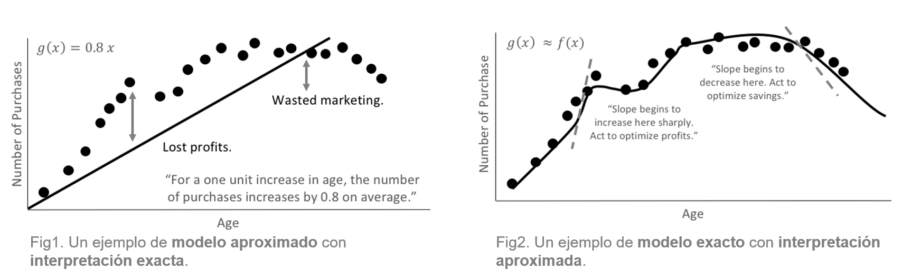
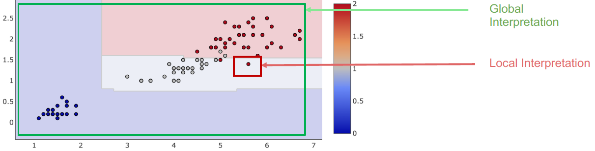
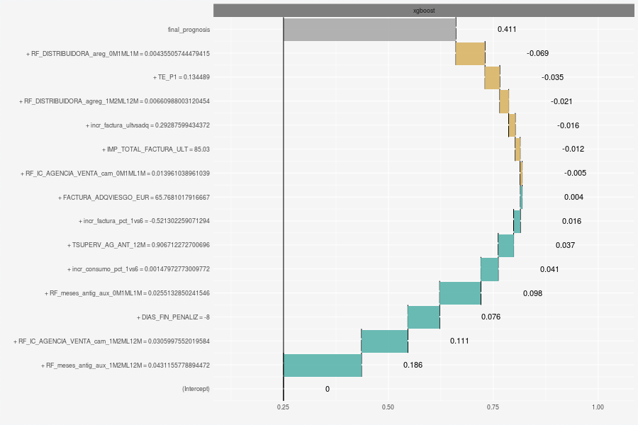
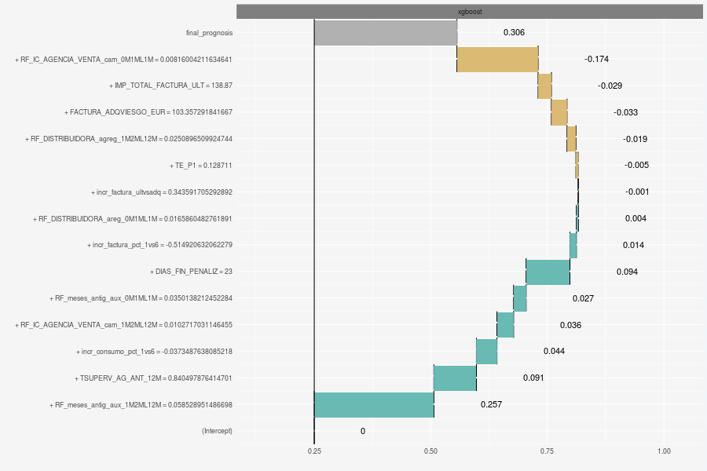
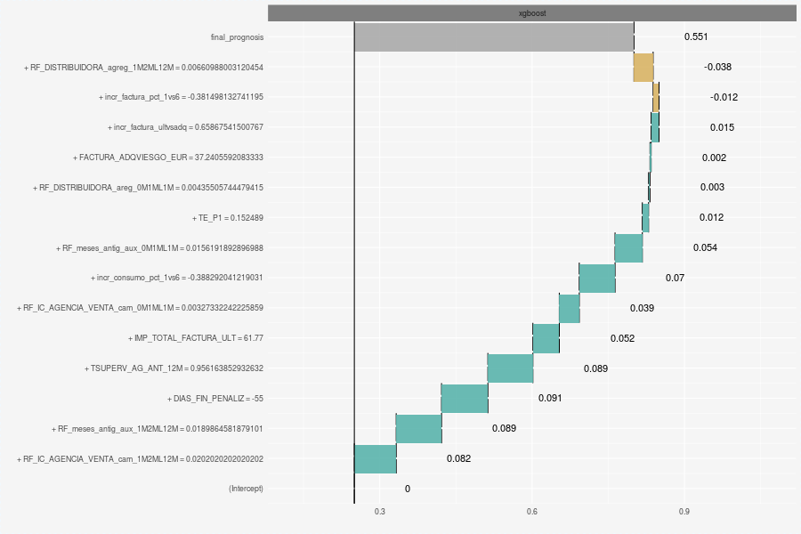
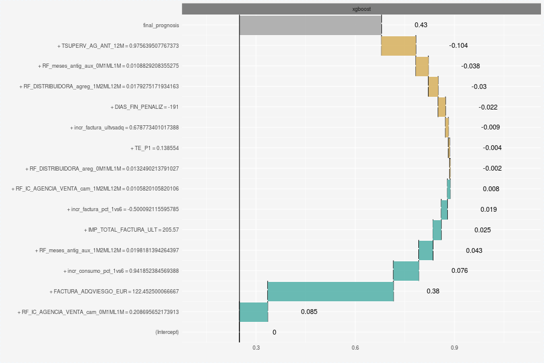
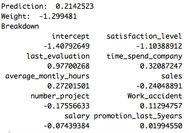
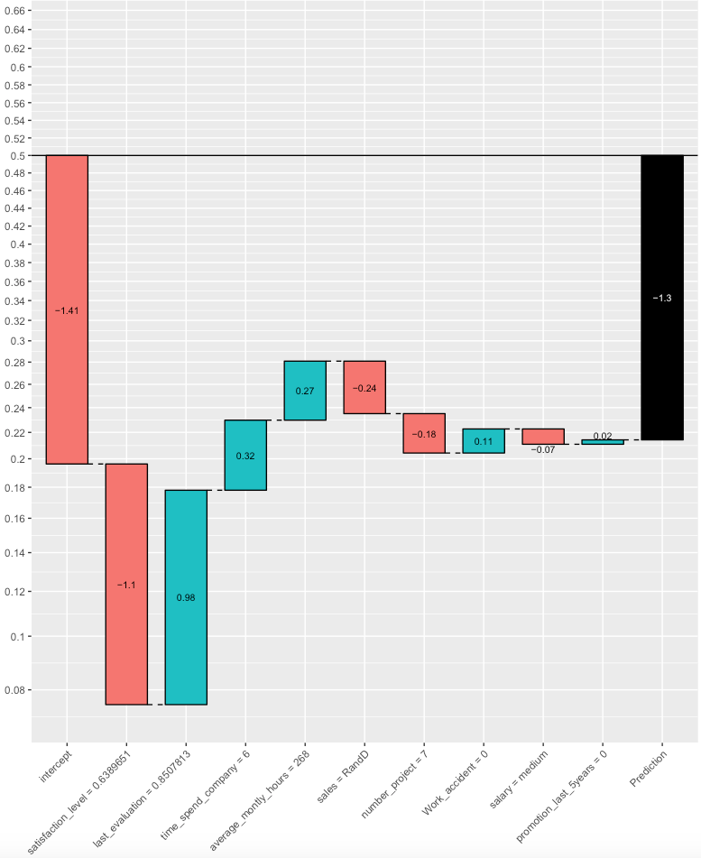

## Interpretando Modelos de Machine Learning

> Interpretación de modelos: habilidad para explicar y presentar un modelo en una forma comprensible para los seres humanos (Doshi and Been, 2017)

Los modelos de Machine learning son conocidos por su alto poder predictivo, pero no por la facilidad de interpretación de sus resultados. Una regresión logística es un ejemplo modelo interpretable. Un modelo de _gradient boosting machine_ o _gbm_ es un ejemplo donde la interpretación no es trivial. Dada la importancia que tiene, desde la perspectiva de la toma de decisiones de negocio, explicar porque se considera que un cliente va a darse de baja o va a presentar una reclamación, hay un creciente número de publicaciones donde se presentan alternativas para abordar este tema.

La figura a continuación ilustra las diferencias en cuanto a interpretabilidad entre un modelo linear, preocupado por entender y prever un comportamiento medio, y un modelo de machine learning, preocupado por capturar todas las relaciones en los datos para garantizar una previsión más precisa. Forma general se puede decir que los modelos lineales son aproximados pero permiten una aproximación exacta, mientras que con machine learning se obtienen modelos muy bien entrenados (exatos) pero difíciles de interpretar.

### Alcance (Scope) de la Interpretación

La interpretación de los modelos se puede realizar con dos perspectivas:

1. Interpretación **GLOBAL**. Permite explicar la interacción entre la variable respuesta (_target_) y las variables explicativas (_features_) utilizando el **conjunto de datos completo**.

1. Interpretación **LOCAL**. Permite explicar la interacción entre la variable respuesta (_target_) y las variables explicativas (_features_) para una única observación o **individuo**.

### Herramientas

Algunas de las herramientas disponibles para interpretar modelos **caja negra** son (no es una lista exhaustiva):

#### Interpretación Global

 * **Importancia de cada variable** _Feature importance_:¿Cuáles son las variables (_features_) más importantes?

 * **Efecto de cada variable**_Feature effects_: ¿Cómo influye una característica en la predicción? - Efectos locales acumulados (_ALE_), gráficos de dependencia parcial (_PDP_) y curvas de expectativa condicional individuales (_ICE_) -
 
 
#### Interpretación Local 

 * **Model-Agnostic** _Explanations for single predictions_: ¿Cómo afectan los valores de cada variable a la predicción puntual? - Algunas opciones: _LIME_, _Shapley value_ , _BreakDown_.

 * **Árboles sustitutos** _Surrogate trees_: ¿Podemos aproximar el modelo de caja negra subyacente con un árbol de decisión corto?
 

### Opciones en R

En _R_ se dispone de varias opciones para aproximar "cajas blancas" a partir de las "cajas negras" (los modelos complejos de machine learning)

* **predict.xgb.Booster: Predict method for eXtreme Gradient Boosting model** Permite calcular las aportaciones de cada característica  a las previsiones individuales. Tiene dos opciones: calcular los valores  _shap_ o utilizar un árbol medio (aproximado)

* **xgboostExplainer: makes XGBoost interpretable**^[https://medium.com/applied-data-science/new-r-package-the-xgboost-explainer-51dd7d1aa211] es un paquete de _R_ que intenta hacer un modelo de _XGBoost_ tan "transparente"" como el árbol de decisión único. La idea básica de este enfoque es sumar las contribuciones que tiene cada árbol ensamblado. Vale la pena señalar que el impacto de una característica o variable depende de la ruta específica que la observación toma a través del conjunto de árboles, por lo que no se puede asociar a un parámetro estático.

* **iml: Interpretable Machine Learning**^[ https://cran.r-project.org/web/packages/iml/vignettes/intro.html] es un paquete de _R_ que proporciona varias herramientas para analizar y entender modelos de Machine Learning. En particular, para la interpretación de previsiones individuales ofrece tres opciones: _Lime_, _Shap_ y _Surrogate trees_.

* **DALEX: Descriptive mAchine Learning EXplanations**^[https://pbiecek.github.io/DALEX_docs/] es un paquete de _R_ que proporciona un conjunto de herramientas que ayudan a comprender cómo funcionan los modelos complejos. Tiene dos aplicaciones: (1) Entender el modelo en sí mismo, y (2) Entender las previsiones individuales. 

Para ayudar en la interpretación de las previsiones indivuduales, DALEX hace uso de _Break Down: Model Agnostic Explainers for Individual Predictions_^[https://pbiecek.github.io/breakDown/]. Se trata de un enfoque conocido como _model agnostic_ porque usa modelos auxiliares (y no el propio modelo) para aproximar la interpretación de resultados. 

### Procedimiento con DALEX

Todas las alternativas de interpretación de resultados individuales son computacionalmente costosas. Por ejemplo, usando _DALEX_, se requieren 2 minutos para desglosar una previsión basada en 20 variables. Sin embargo, se requieren 10 minutos para desglosar una única prevsión basada en 50 variables^[Aumentando las variables de 20 a 50 (x2.5), aumenta 5 veces el tiempo computacional.]. En otras palabras, el tiempo necesario aumenta exponencialmente con la coplejidad del modelo.

Por dicho motivo, utilizamos un procedimiento aproximado para interpretar los resultados del modelo:

 1.  Clasificamos el TOP 2.5% de Clientes con mayor probabilidad de fuga en 15 _clusters_ (grupos homogéneos) utilizando todas las características más importantes hasta el 75%^[Tanto el número de clusters como el cut-off en el gain para seleccionar variables son parametrizables].
 1. Utilizamos el _explainer_ de _DALEX_  para desglosar la previsión de cada uno de los clientes tipo (medoide) de cada cluster.
 1. Asumimos que la explicatividad del medoide es extensible a todos los miembros de su grupo.
 
 
 Este enfoque ofrece ventajas como:
 
 1. Ejecutar los procedimientos en tiempo asumibles en el entorno de producción.
 1. Proporcionar una buena aproximación a la interpretación de la previsión individual de todos los clientes.
 1. Proporcionar una interpretación agnóstica del modelo, priorizando las variables más importantes en la construcción de la previsión.

### Procedimiento con xgboostExplainer

Esta opción es computacionalmente menos costosa y permite aproximar la interpretación de todas las previsiones de un lote de, por ejemplo, 7000 clientes en minutos. Además de ofrecer el peso de cada característica en cada previsión individual, ofrece un presentación gráfica muy similar a la proporcionada por DALEX.

Para facilitar la interpretación de resultados, se recomienda utilizar un modelo simplificado donde participen las variables que conttribuyan con, por ejemplo, el 75% del gain del modelo.

Nota: Algunos recomiendan usar directamente la funición predict del xgboost con la opcion contrib=TRUE antes que las funciones del XGBoostExplainer. (ver aqui^[https://www.reddit.com/r/learnmachinelearning/comments/9n2kq2/fyi_for_those_of_you_using_the_xgboostexplainer/])

#### Ejemplo

### Anexo

